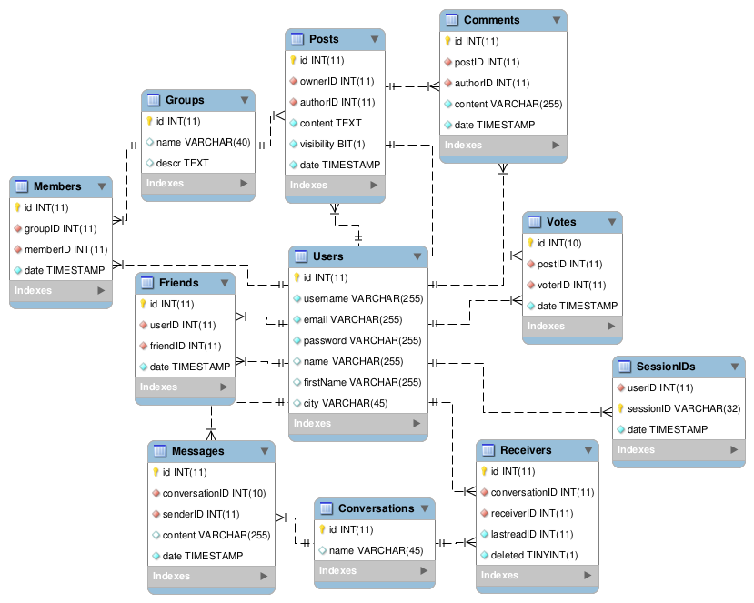

# Server
This is the server side of our n3twork.

[TOC]

# Introduction
We used eclipse to generate a `n3.war` we deployed on our Tomcat 8 Server.

The server is seperated into two parts, as is indicated by the directory structure: classes, which contains the classes, whose objects are used, and servlet, which contains classes of the REST API.

# classes
The class `Main` is only used for testing. 

## User
This class is central to *n3twork*, which is to be expected from a social network. Most of the db queries are found here. An object of this class represents a user in the network. The most used attributes are:

- `id` is a unique integer and analog to the `id` column in the `Users` table
- `name` and `firstName` describe the name of the user
- `username` is a unique String and analog to the `username` column in the `Users` table
- `email` should also be a unique String, but is only used on login as a identifier
- `password` is allways hashed with md5
- `sessionID` is a md5 hash of the username with the current time in milliseconds concatenated
- `otherProperties` is a HashMap of all other attributes a user could have (e.g. city, bio, workplace). This is implemented dynamically: support for a new property only has to be added to the client and the db

The feature of friends is also implemented in `User`. It uses two attributes:

- `friends` is a `HashMap<User, SimpleEntry<Long, Boolean>>`
    - the key is the user object of the friend
    - the key of the `SimpleEntry` is the timestamp when the connection was established
    - the value of the `SimpleEntry` is true if the connection exists both ways
- `friendRequests` is a `HashMap<User, Long>`
    - the key is the user object of the friend request
    - the value is the timestamp of the time the friend request was made

## Group
`Group` is part of the implementation of the groups feature. An object of the class represents a group with the following attributes:

- `id` is a unique identifier, related to the `id` column in the `Groups` table
- `name` and `descr` describe the group
- `members` is a list of `User` objects
- `memberCount` is needed to save the lenght of `members` without having the list
- `otherProperties` is equal to the correspondent attribute in [User](#user)
- `posts` see [Post](#post)

A lot of the user related methods are found in `User`

## Post
Objects of this class represents posts of users on their profil or in a group. The attibutes are:

- `id` is a unique identifier, related to the `id` column in the `Posts` table
- `owner` is a group
- `author` is the user, who wrote the post
- `content` explains itself
- `postDate` is the date of the creation of the post
- `privatePost` is true if the post should only be visual to friends of the `author`. This is irrelevant, if `goupPost` is true.
- `groupPost` is true if the post is in a group and false if it should be displayed in the profil. If it is false, `owner` is ignored
- `upvotes` is a `HashMap<User,Date>`. The key is the voter and the value the date of voting
- `numberOfUpVotes` is needed to save the size of `upVotes` without having the Map
- `didIVote` is true if the spectating user has already voted
- `comments` is a `HashMap<SimpleEntry<User,Integer>,SimpleEntry<String,Date>>`, which indicates, that this should've been a seperate class
    - the key of the key is the commentator
    - the value of the key is the comment id (from `Comments` table in db)
    - the key of the value is the content
    - the value of the key is the date of creation
- `numberOfComments` is needed to save the size of `comments` without having the Map

Methods retrieving posts from the db, like getting the newsfeed, are implemented in `User`

## Conversation
This class is responsible for the messaging system of the network. It's mainly composed of a list of receivers and a list of messages.
Attributes:

- `id` is a unique identifier, related to the `id` column in the `Conversations` table
- `messageList` is a list of messages (see [Message](#message))
- `receivers` is a list of users, including the sending user
- `lastRead` is the `id` of the last message read by the querying user
- `unread` is the number of unread messages in the conversation
- `name` is an optional attribute

Similar to `Post`, the method neccessary to get user specific list from the db is in `User`

### Message
An object of this class represents a message within a conversation. It's main purpose is to simplify `Conversation`. It only consists of setters and getters to modify the following attributes:

- `id` is a unique identifier, related to the `id` column in the `Messages` table
- `content` explains itself
- `sendDate` date of creation
- `sender` is the user, who send the message

## Suggestion
This class contains the two static functions to the friend suggestions.

### `networkSuggestion(User)`
All friends of friends, which are not friends of the analyzed user, are selected. Then the function counts how often a user is contained in that list and returns a list of users without duplicates, sorted by that count.

### `postBasedSuggestion(User)`
The posts of all users, who are not friends with the analyzed user are selected. Those posts are split into words and the function then counts how often what word appears in the posts of a user.
After creating the word-user matrix the algorithm of the lecture is applied to get a sorted list of users.

# Database Model

## Basics
When a user registers in the system, username, email, and the hashed password are saved in `Users` and a id is automatically generated. The user can then login with username or email and password and get a sessionID (which is a md5 of the username + current time in miliseconds). Users can get an unlimited amount of sessionIDs and the cleanup is on the clientside.

Additional information of a user is added to the `Users` table. If support for a new field is supposed to be added, a new column has to be added to this table, but there are no changes in the backend required.

If a user is deleted all references to that user are deleted aswell.

## Friends
Friends are implemented through the table `Friends`. `userID` represents the user, who actively added the user in `friendID`. Here is an example:

userID|friendID
:---:|:---:
1|2
2|1
3|1

In this example user **1** added user **2** and user **2** added user **1**. User **3** only added user **1** but not the other way around; user **3** made a not yet accepted friend request to user **1**.

## Groups
The tables used for this feature are `Groups` and `Members`. `Groups` contains a name of the group and a description, while `Members` connects users to a group. The date a user joined a group is automatically saved.

## Posts
Three tables were needed for this feature: `Posts`, `Comments` and `Votes`. It also has a relation to `Groups`, because users can decide if they want to post in a group or on their profile. To support this, there are too columns with foreign keys: `ownerID` and `authorID`. `ownerID` represents the group, which "ownes" the post. The id is 0 if the post is on a profile; otherwise, the post is part of a group. The `authorID` is the id of the user, who wrote the post. The date of a post is automatically saved.

### Comments
The `Comments` table is essentialy a second `Posts` table with the difference, that the "owner" is now a post through `postID`,but the date of a comment is automatically saved and doesn't have to be set.

### Votes
`Votes` is like the `Comments` table without the `content` column and `authorID` is renamed `voterID`

## Conversations
For the messaging feature 3 tables are used:

- `Messages` to save every individual message
- `Receivers` for participants of a conversation
- `Conversations` to tie everything together; this table consists just of an id and an optional name for a conversation

### Messages
Messages consist of a link to the conversation they're a part of, a sender and the content. The date the message was send is saved automatically. 

### Receivers
This table saves all participants of a conersation and their status within the conversation. `lastreadID` is the id of the last read message and 0, if there are no messages in the conversation. The flag `deleted` is 1, if the user has marked a conversation as archived and doesn't want to see it until new messages arrive. It is set to 0 by the backend, if someone writes a new message in this conversation.


# servlet

There are only two endpoint, that aren't a POST request, but a PUT request, which are:

- [/user/settings](#usersettings)
- [/post/update](#postupdate)

Dates are always in the unix timestamp format

## `/login`
Logs in a user with username or email and the password in plain text. 

in:
``` json
{
    "login" : "username/email", 
    "password" : "pw in plain text"
}
```
out:
``` json
{
    "session":"sessionID",
    "id":0,
    "username":"username",
    "email":"email",
    "lastname":"last name",
    "firstName":"first name",
    "otherProperties":{
        "propertie1":"value",
        "propertie2":"value",
    },
    "successful":true
}
```
## `/logout`
Deletes the sessionID from the database

in:
``` json
{
    "session" : "sessionID"
}
```
out:
``` json
{
    "successful":true
}
```
## `/register`
Hashes the password and puts all items in the db

in:
``` json
{
    "email":"email@text",
    "password":"pw as plain text",
    "username":"usernametext"
}
```
out:
``` json
{
    "successful":true
}
```
## `/register/checkuser`
Checks if the username is taken or not

in:
``` json
{
    "username":"usernametext"
}
```
out:
``` json
{
    "username":"usernametext",
    "taken":true false,
    "successful":true
}
```
## `/user`
Gets a user by id or gets the current user by the sessionID if no id is given and returns profile related attributes.

in:
``` javascript
{
	"session":"sessionID",
	"id":1337 //optional
}
```
out:
``` json
{
    "email": "zwerch1337@gmail.com",
    "firstName": "Robin",
    "id": 45,
    "lastname": "Temme",
    "otherProperties": {},
    "session": "",
    "successful": true,
    "username": "zwerch"
}
```
## `/user/settings`
Changes the given attributes for the current user

in:
``` json 
{
  "session":"sessionID",
  "changedSetting1":"newValue1",
  "changedSetting2":"newValue2",
  "otherProperties":{
    "changedPropertie1":"newValue3",
    "changedPropertie2":"newValue4"
  }
}
```
out:
``` json
{
  "successful":true/false
}
```
## `/user/remove`
Removes the current User from the db

in:
``` json
{
	"session":"sessionID"
}
```
out:
``` json
{
    "successful": true
}
```
## `/user/find`
Returns a list of all users

in:
``` json
{
    "session":"sessionID"
}
```
out:
``` json
{
    "successful": true,
    "userList": [
        {
            "email": "asd@asd.de",
            "firstName": "",
            "id": 29,
            "lastname": "",
            "otherProperties": {},
            "username": "asdddddd"
        },
        {
            "email": "theres...neider@gmail.com",
            "firstName": "",
            "id": 30,
            "lastname": "",
            "otherProperties": {},
            "username": "Tessa1337"
        },
    ]
}
```
## `/user/count`
Returns total number of users and number of users online
in:
``` json
{
    "session": "sessionID"
}

```
out:
``` json
{
    "users": 11,
    "usersOnline": 3
}
```

## `/user/friends`
Returns friends of the current user, or of a user with a specific id
in:
``` javascript
{
	"session":"sessionID",
	"id":45 //optional
}
```
out:
``` json
{
    "friends": [
        {
            "date": 1417123181000,
            "email": "zwerch1337@gmail.com",
            "firstName": "Robin",
            "id": 45,
            "lastname": "Temme",
            "trueFriend": false,
            "username": "zwerch"
        },
        {
            "date": 1417122900000,
            "email": "horst@dieter.ded",
            "firstName": "",
            "id": 42,
            "lastname": "",
            "trueFriend": false,
            "username": "ddasddddddasdasdasd"
        },
    ],
    "successful": true
}
```
## `/user/friendrequests`
Returns friendrequests for the current user, or of a user with a specific id
in:
``` javascript
{
    "session": "sessionID",
    "id":45 "//optionsl"
}
```
out:
``` json
{
    "friendRequests": [
        {
            "date": 1417208589000,
            "email": "dieter@rasse.de",
            "firstName": "Dieter",
            "id": 44,
            "lastname": "Rasse",
            "trueFriend": false,
            "username": "dieter"
        },
    ],
    "successful": true
}
```
## `/user/friend/add`
Adds a friend for the current user

in:
``` json
{
	"session":"sessionID",
	"friend":1337
}
```
out:
``` json
{
    "successful": true
}
```
## `/user/friend/remove`
Removes a friend for the current user
in:
``` json
{
	"session":"sessionID",
	"friend":1337
}
out:
``` json
{
    "successful": true
}
```
## `/user/groups`
Returns groups of the current user, or of a user with a specific id

in:
``` javascript
{
	"session":"sessionID",
	"id":45 //optional
}
```
out:
``` json
{
    "groups": [
        {
            "groupDescr": "Beschreibung",
            "groupID": 2,
            "groupName": "Coole Gruppe"
        }
    ],
    "successful": true
}
```
## `/user/group/join and /user/group/leave`
Joins/leaves a group for the curren user

in:
``` json
{
	"session":"sessionID",
	"group":1337
}
```
out:
``` json
{
    "successful": true
    "//Bei join auch wenn der user schon Mitglied ist. Wird aber nicht 2x in der db registriert"
}
```
## `/group/create`
Creates a new group

in:
``` json
{
    "groupDescr": "Beschreibung",
    "groupName": "Name",
    "session": "sessionID"
}
```
out:
``` json
{
    "successful": true
}
```
## `/group/show`
Returns details of a group

in:
``` json
{
	"session":"sessionID",
	"group":1337
}
```
out:
``` json
{
    "descr": "Beschreibung",
    "id": 2,
    "name": "Name",
    "otherProperties": {},
    "successful": true
}
```
## `/group/find`
Returns a list of all groups

in:
``` json
{
	"session":"sessionID"
}
```
out:
``` json
{
    "groups": [
        {
            "groupDescr": "Beschreibung",
            "groupID": "2",
            "groupName": "Coole Gruppe"
        },
        {
            "groupDescr": "Beschreibung",
            "groupID": "2",
            "groupName": "Coole Gruppe"
        },
    ],
    "successful": true
}
```
## `/group/count`
Returns the number of groups in the network

in:
``` json
{
    "session": "sessionID"
}
```
out:
``` json
{
    "groups": 5
}
```
## `/group/members`
Returns a list of the members of a group
in:
``` json
{
	"session":"sessionID",
	"group":1337
}
```
out:
``` json
{
    "members": [
        {
            "email": "dieter@rasse.de",
            "firstName": "Dieter",
            "id": 44,
            "name": "Rasse",
            "username": "dieter"
        },
        {
            "email": "johannes@n3rdkeller.de",
            "firstName": "",
            "id": 47,
            "name": "",
            "username": "johannes"
        },
    ],
    "successful": true
}
```
## `/post`
Returns the posts of the current user, a specific user or a group.
in:
``` javascript
{
    "groupID":0, //optional
    "userID":0, //optional
    "session":"sessionID"
}
```
out:
``` json
{
    "postList": [
        {
            "author":authorID number,
            "content":"content text",
            "id":postID number,
            "owner":ownerID number,
            "postDate":timestamp number,
            "upVotes": [
                {
                    "date":timestamp number,
                    "voter":voterID number
                },
            ],
            "private":true/false
        },
    ],
    "successful":true
}
```
## `/post/newsfeed`
Returns the newsfeed for the curren user
in:
``` json
{
    "session":"sessionID"
}
```
out:
``` json
{
    "postList": [
        {
            "author":authorID number,
            "content":"content text",
            "id":postID number,
            "owner":ownerID number,
            "postDate":timestamp number,
            "upVotes": [
                {
                    "date":timestamp number,
                    "voter":voterID number
                },
            ],
            "private":true/false
        },
    ],
    "successful":true
}
```
## `/post/votes`
Returns the votes for a post

in:
``` json
{
    "id":0,
    "session":"sessionID"
}
```
out:
``` json
{
    "voteList": [
        {
            "date":123123123,
            "voter":{
                "firstName":"firstName",
                "name":"name",
                "username":"username"
            }
        },
    ],
    "successful":true
}
```
## `/post/add`
Posts to the profile of the current user or to a group
in:
``` javascript
{
    "groupID":0, //optional
    "session":"sessionID",
    "post": {
        "content":"",
        "private":true false
    }
}
```
out:
``` json
{
    "successful":true
}
```
## `/post/delete`
Deletes a post by id
in:
``` json
{
    "session":"sessionID",
    "id":0 
}
```
out:
``` json
{
    "successful":true
}
```
## `/post/update`
Changes the attributes of a post

in:
``` javascript
{
   "session":"sessionID"
   "id":0,
   "content":"", //optional
   "private":true/false //optional
}
```
out:
``` json
{
   "successful":true
}
```
## `/post/vote/add and /post/vote/remove`
Adds/removes a vote by the current user from a post by postID

in:
``` json
{
    "id":0,
    "session":"sessionID"
}
```
out:
``` json
{
    "successful":true
}
```
## `/post/comments`
Gets the comments of a specific post by postID

in:
``` json
{
    "id":0,
    "session":"sessionID"
}
```
out:
``` json
{
    "commentList":[
        {
            "author":{
                "firstName":"firstName text",
                "lastname":"lastname text",
                "username":"username text"
            },
            "content":"content text",
            "date":123123123, 
            "id":0
        },
    ],
    "successful":true
}
```
## `/post/comment/add`
Add a comment by the curren user to a post by postID

in:
``` json
{
    "id":0, 
    "content":"contentOfComment",
    "session":"sessionID"
}
```
out:
``` json
{
    "successful":true
}
```
## `/post/comment/remove`
Removes a comment by commentID

in:
``` json
{
    "id":0, 
    "session":"sessionID"

}
```
out:
``` json
{
    "successful":true
}
```
## `/conversation`
Returns the list of conversations, the current user is a part of

in:
``` json
{
    "session":"sessionID"
}
```
out:
``` json
{
    "conversationList": [
        {
            "receiverList": [
                {
                "username":"",
                "firstName":"",
                "lastName":"",
                "email":"",
                "emailhash":""
                },
            ],
            "lastread":0,
            "name":"",
            "id":0
        },
    ],
    "successful":true
}
```
## `/conversation/show`
Returns the list of messages of a conversation

in:
``` json
{
    "session":"sessionID",
    "conversationID":0, 
}
``` 
out:
``` json
{
    "messageList":[
        {
            "content":"content",
            "senderDate":456456465465,
            "senderID":0
        },
    ],
    "successful":true
}
```
## `/conversation/send`
Sends a message in a conversation and returns the id of the new message.

in:
``` json
{
    "session":"sessionID",
    "content":"asdfasdf",
    "conversationID":0
}
```
out:
``` json
{
    "successful":true,
    "id":0 
}
```
## `/conversation/new`
Creates a new conversation and returns its id.

in:
``` javascript
{
    "session":"sessionID",
    "name":"conName", //optional
    "receiverList":[
        {
            "username":"username"
        },
    ]
}
```
out:
``` json
{
    "successful":true,
    "conversationID":0
}
```
## `/conversation/archive`
Sets the `deleted` flag in the db

in:
``` json
{
    "session":"sessionID",
    "conversationID":0
}
```
out:
``` json
{
    "successful":true
}
```
## `/conversation/unread`
Returns the number of unread conversations of the current user

in:
``` json
{
    "session":"sessionID"
}
```
out:
``` json
{
    "unread":0,
    "successful":true
}
```
## `/conversation/rename`
Renames a conversation

in:
``` json
{
    "session":"sessionID",
    "id":0,
    "name":"new name"
}
```
out:
``` json
{
    "successful":true
}
```
## `/suggestion/network`
Returns all suggestions based on the friend network and sorted by rating

in:
``` json
{
    "session":"sessionID"
}
```
out:
``` json
{
    "userList": [
        {
            "date": 1417123181000,
            "email": "zwerch1337@gmail.com",
            "firstName": "Robin",
            "id": 45,
            "lastname": "Temme",
            "trueFriend": false,
            "username": "zwerch"
        },
        {
            "date": 1417122900000,
            "email": "horst@dieter.ded",
            "firstName": "",
            "id": 42,
            "lastname": "",
            "trueFriend": false,
            "username": "ddasddddddasdasdasd"
        },
    ],
    "successful": true
}
```
## `/suggestion/post`
Returns all suggestions based on content of posts and sorted by rating

in:
``` json
{
    "session":"sessionID"
}
```
out:
``` json
{
    "userList": [
        {
            "date": 1417123181000,
            "email": "zwerch1337@gmail.com",
            "firstName": "Robin",
            "id": 45,
            "lastname": "Temme",
            "trueFriend": false,
            "username": "zwerch"
        },
        {
            "date": 1417122900000,
            "email": "horst@dieter.ded",
            "firstName": "",
            "id": 42,
            "lastname": "",
            "trueFriend": false,
            "username": "ddasddddddasdasdasd"
        },
    ],
    "successful": true
}
```